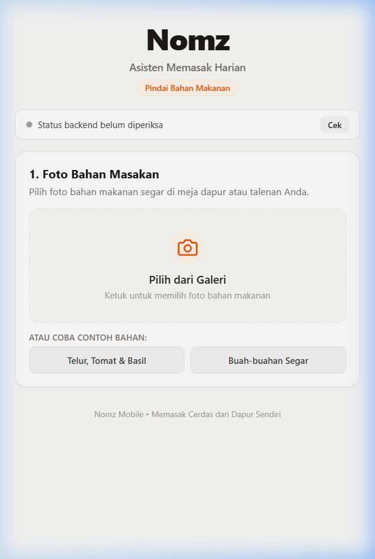
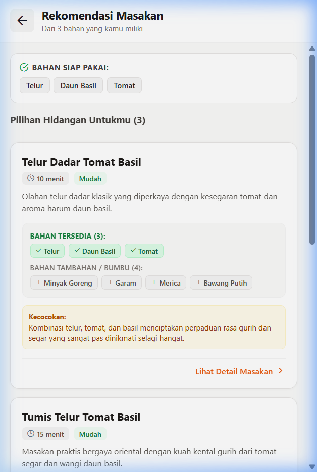
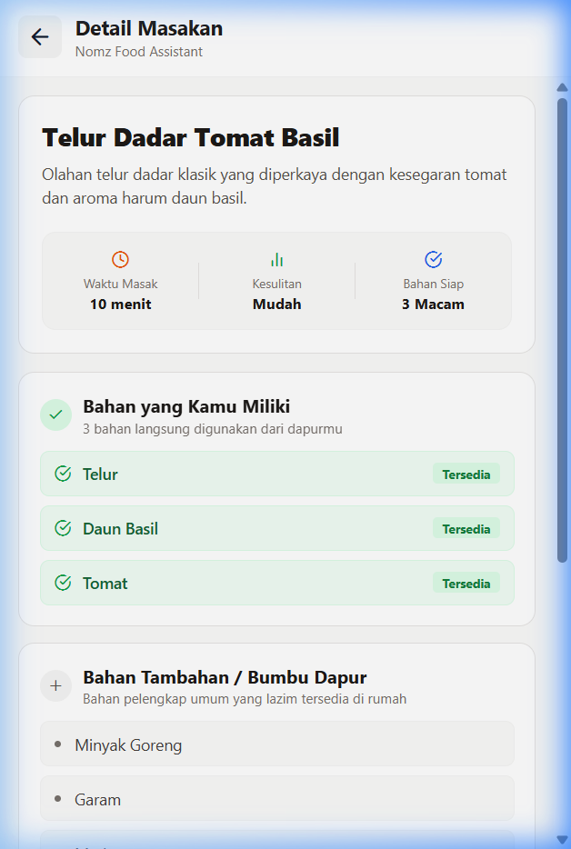

# Nomz

Nomz adalah mobile food assistant untuk membantu pengguna merencanakan masakan dari bahan-bahan yang sudah ada di dapur. Aplikasi mendeteksi bahan dari foto, memvalidasi bahan bersama pengguna, dan menghasilkan rekomendasi masakan praktis melalui orkestrasi workflow Langflow.

---

## Masalah yang Diselesaikan

Banyak bahan makanan di dapur terbuang karena pengguna bingung harus memasak apa dari bahan sisa yang ada. Nomz membalik alur pencarian resep konvensional: alih-alih mencari resep lalu berbelanja bahan, Nomz memulai dari bahan yang benar-benar tersedia di dapur pengguna.

---

## Cara Kerja

1. **Pindai Bahan**: Pengguna mengambil foto bahan masakan di dapur atau memilih foto dari galeri.
2. **Deteksi Multimodal**: Backend vision mendeteksi bahan makanan secara otomatis dalam Bahasa Indonesia terstruktur.
3. **Konfirmasi Bahan**: Pengguna dapat menyunting, menghapus, atau menambahkan bumbu dapur secara manual.
4. **Eksekusi Workflow Langflow**: Daftar bahan terkonfirmasi dikirim ke workflow Langflow `find_meals` pada backend.
5. **Rekomendasi Terstruktur**: Langflow memproses prompt dan model untuk menghasilkan 2-3 rekomendasi masakan realistis dengan pemisahan jelas antara bahan yang dimiliki pengguna vs bahan tambahan yang diperlukan.
6. **Detail Masakan**: Pengguna memilih masakan untuk melihat metrik waktu, tingkat kesulitan, serta rincian bahan.

---

## Arsitektur Sistem

```text
React Native / Expo (Mobile Frontend)
         │  HTTP / REST
         ▼
      FastAPI (Backend Gateway)
         │  POST /api/v1/run/{flow_id}
         ▼
 Langflow `find_meals` (Workflow Engine)
         │
         ▼
      AI Model (Gemini)
```

- **Ingredient Vision**: Diproses langsung oleh backend FastAPI menggunakan Gemini Multimodal dengan structured schema JSON.
- **Recipe Recommendation**: Dikelola dan dieksekusi oleh workflow Langflow (`find_meals`).
- **Data Boundary**: FastAPI bertindak sebagai API gateway yang memvalidasi request mobile, mengeksekusi Langflow via REST, serta memvalidasi response schema sebelum dikembalikan ke mobile client.

---

## Fitur yang Berjalan

- [x] Health check backend dan koneksi database SQLite (`GET /api/health`).
- [x] Upload foto bahan masakan dengan validasi MIME dan batas ukuran file (`POST /api/vision/detect-ingredients`).
- [x] Deteksi bahan makanan berbasis multimodal AI dalam Bahasa Indonesia alami.
- [x] Antarmuka mobile untuk pemilihan foto, pratinjau, pengeditan nama bahan, penambahan bahan manual, dan konfirmasi.
- [x] Eksekusi workflow rekomendasi masakan via Langflow runtime (`POST /api/recommendations`).
- [x] Kartu rekomendasi masakan dengan pemisahan bahan tersedia vs bahan tambahan.
- [x] Layar detail masakan dan navigasi bolak-balik tanpa merusak state bahan.
- [x] Kompatibilitas cross-platform: Expo Web dan physical Android (Expo Go via network IP).

---

## Status Pengembangan

| Milestone | Ruang Lingkup | Status |
| :--- | :--- | :--- |
| **M0** | Foundation: FastAPI + SQLite + Expo boilerplate + Health check | **Complete** |
| **M1** | Ingredient Vision: Multimodal detection + mobile confirmation flow | **Complete** |
| **M2** | Meal Recommendation: Structured recipe generation + mobile screens | **Complete** |
| **M3** | Real Langflow Integration: Runtime execution of `find_meals` flow | **Complete** |
| **M4** | IBM Bob & Model Context Protocol (MCP) Integration | **Complete** |

---

## Tech Stack

- **Frontend**: React Native, Expo SDK 52, TypeScript, `@expo/vector-icons` (Feather).
- **Backend**: Python 3.11, FastAPI, Pydantic v2, SQLAlchemy, HTTPX, Uvicorn.
- **Workflow / AI Engine**: Langflow 1.12.3 (Docker), Google Gemini via `google-genai` / Langflow Google Component.
- **Testing**: Pytest, FastAPI TestClient.

---

## Struktur Direktori

```text
Nomz/
├── backend/
│   ├── app/
│   │   ├── api/routes/          # Endpoint health, vision, dan recommendations
│   │   ├── core/config.py       # Pydantic Settings (env loader)
│   │   ├── db/                  # Database session & models
│   │   ├── schemas/             # Pydantic request/response schemas
│   │   └── services/            # Services: vision, langflow client, recommendation
│   ├── requirements.txt
│   └── .env.example
├── bob/
│   ├── agent-instructions.md    # Instruksi sistem agent IBM Bob (delegasi find_meals)
│   └── mcp-config.example.json  # Template aman MCP config untuk IBM Bob
├── frontend/
│   ├── src/
│   │   ├── screens/             # ScanBahanScreen, RekomendasiScreen, DetailResepScreen
│   │   ├── services/api.ts      # Client HTTP & upload multipart
│   │   └── types/               # TypeScript interfaces
│   ├── App.tsx                  # Root navigation stack
│   ├── package.json
│   └── .env.example
├── langflow/
│   ├── find_meals.json          # Export flow Langflow M3
│   └── README.md                # Dokumentasi node & runtime endpoint
├── screenshots/                 # Dokumentasi visual prototype M0-M3
├── tests/                       # Pytest automated test suites
├── .env.example                 # Root environment template
└── README.md
```

---

## Panduan Menjalankan Project

### 1. Prasyarat
- Python 3.11+
- Node.js 18+ & npm
- Docker (untuk menjalankan Langflow)

### 2. Langflow Setup
Jalankan instance Langflow lokal (port default `7860`):
```bash
docker run -d -p 7860:7860 --name langflow langflowai/langflow-all:latest
```
Import flow [langflow/find_meals.json](file:///d:/Projects/Bob/Nomz/langflow/find_meals.json) ke instance Langflow Anda, atau gunakan flow ID yang telah terdaftar.

### 3. Backend Setup
```bash
cd backend
python -m venv .venv

# Windows:
.venv\Scripts\activate
# Linux/macOS:
# source .venv/bin/activate

pip install -r requirements.txt
copy .env.example .env   # isi GEMINI_API_KEY dan LANGFLOW_API_KEY

uvicorn app.main:app --host 0.0.0.0 --port 8000 --reload
```

Verifikasi endpoint:
- Health check: `http://localhost:8000/api/health`
- Swagger docs: `http://localhost:8000/api/docs`

### 4. Frontend Setup
```bash
cd frontend
npm install
copy .env.example .env   # sesuaikan EXPO_PUBLIC_API_URL

# Jalankan Expo:
npx expo start
```
- Tekan `w` untuk menjalankan di web browser (`http://localhost:8081`).
- Untuk testing di smartphone fisik via Expo Go, set `EXPO_PUBLIC_API_URL=http://<IP_LAN>:8000` di `frontend/.env`.

### 5. IBM Bob & MCP Integration (M4)

Nomz mendukung integrasi dengan IBM Bob melalui Model Context Protocol (MCP) untuk menghubungkan agen AI langsung ke workflow Langflow `find_meals`:

1. Salin template MCP:
   ```bash
   # Windows PowerShell:
   copy bob\mcp-config.example.json .bob\mcp.json
   ```
2. Isi nilai header `x-api-key` di `.bob/mcp.json` dengan API key Langflow lokal Anda. (File `.bob/mcp.json` otomatis diabaikan oleh `.gitignore` demi keamanan kredensial).
3. Buka project Nomz di IBM Bob. Agent IBM Bob akan otomatis mendeteksi tool `find_meals` dan panduan delegasi dari `bob/agent-instructions.md`.

---

## Menjalankan Automated Tests

Eksekusi seluruh test suite (M0–M4) dari root direktori project:
```bash
# Windows PowerShell:
$env:PYTHONPATH="backend"
backend\.venv\Scripts\python -m pytest -v tests/
```

Typecheck TypeScript pada frontend:
```bash
cd frontend
npx tsc --noEmit
```

---

## Screenshot Aplikasi

| Pindai Bahan & Deteksi (M1) | Daftar Rekomendasi Langflow (M2-M3) | Detail Resep Masakan (M2) |
| :---: | :---: | :---: |
|  |  |  |
